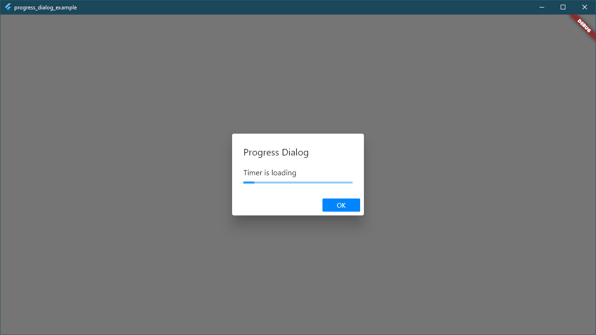

# progress_dialog
This is a simple progress dialog, completely written on dart

## Platforms supported
 - Android
 - iOS
 - Windows
 - Web

### How to use?
```dart
final pd = ProgressDialog()

//Shows a simple progress dialog with indeterminate progress
pd.show(
    title: "Progress Dialog",
    description: "Timer is loading",
    onTap: () {
        pd.dismiss();
      }
    );

for (int i=0; i<100; i++){
    pd.update(percent: i);
}
```

### Screenshots
<br>


